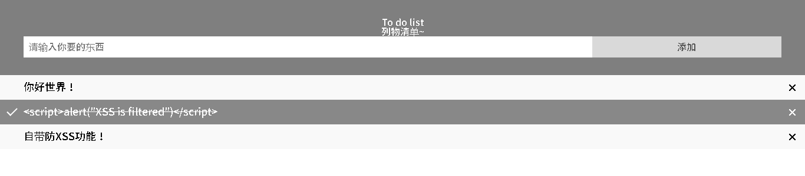

### Hosted by:

# Side Project —— to-do-list
- 最一开始做的版本，是完全没有任何的储存功能，只有展示用途。
- 新改造的版本，使用了cookie的功能来达成游览器储存的功能。
- 目前删除功能还是有点炸，如果各位有更好的方案可以pull request你们的解答上来，感谢各位ouob

# 主要内容：
### 
- 可以新增，标记已完成，还有展示用的删除功能。
- 打字的时候 整个视窗会抖动，还有特效awa

# 目前进度：
- Index： *删除功能目前坏掉了，坐等大佬pull request过来*
